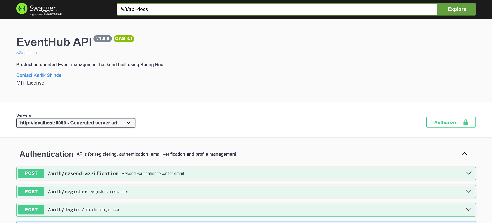
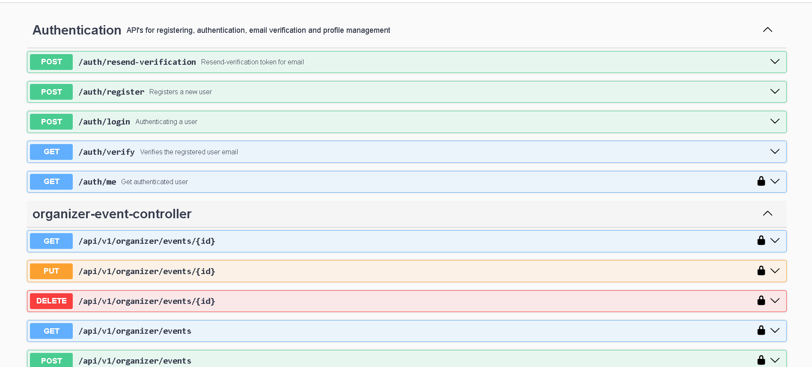
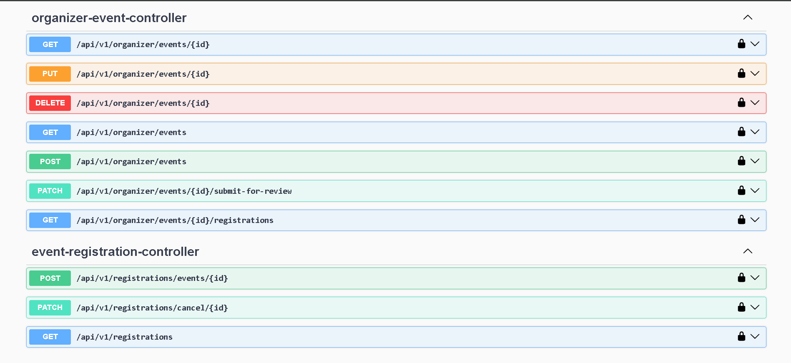

# EventHub - Event Management Platform

A production-oriented Event Management REST API built with **Java** and **Spring Boot**, focusing on clean architecture, business-driven design, and real-world backend engineering practices.

EventHub allows organizers to create and manage events, administrators to review and publish them, and attendees to discover, register for, and manage event registrations through secure REST APIs.

---

## Features

### Authentication & Authorization

* JWT Authentication
* Email Verification
* Role-Based Access Control (Admin, Organizer, Attendee)
* Spring Security
* Stateless Authentication

---

### Organizer Features

* Create Draft Events
* Update Draft Events
* Delete Draft Events
* Submit Events for Approval
* View Personal Events
* View Event Details
* View Registered Attendees

---

### Admin Features

* Review Submitted Events
* Approve Events
* Reject Events
* Moderate Public Events

---

### Attendee Features

* Browse Public Events
* Search Events
* Filter Events
* View Event Details
* Register for Events
* Cancel Registrations
* View Registration History

---

### Event Lifecycle Automation

Automatic status transitions using Spring Scheduler.

```text
DRAFT
    │
    ▼
PENDING_APPROVAL
    │
    ▼
PUBLISHED
    │
    ▼
REGISTRATION_OPEN
    │
    ▼
REGISTRATION_CLOSED
    │
    ▼
ONGOING
    │
    ▼
COMPLETED
```

---

## Tech Stack

### Backend

* Java 17
* Spring Boot 4
* Spring Security
* Spring Data JPA
* Spring MVC
* PostgreSQL
* JWT (JJWT)
* Bean Validation
* MapStruct
* Lombok
* Spring Scheduler
* Java Mail Sender
* Swagger / OpenAPI
* Maven

---

## Architecture

The project follows a feature-based architecture.

```text
src/main/java/com/eventhub

├── auth
├── common
├── config
├── event
├── registration
└── user
```

Each feature contains its own:

* Controller
* Service
* Repository
* DTO
* Mapper
* Entity
* Exception

Business logic is isolated within the service layer while controllers remain thin.

---

## Event Workflow

```text
Organizer

↓

Create Draft

↓

Submit Event

↓

Admin Review

↓

Publish Event

↓

Registration Opens Automatically

↓

Registration Closes Automatically

↓

Event Starts

↓

Event Completes
```

---

## Registration Workflow

```text
Attendee

↓

Browse Events

↓

Register

↓

View Registrations

↓

Cancel Registration
```

---

## Business Rules

### Organizer

* Can create draft events.
* Can update or delete only draft events.
* Cannot publish events directly.
* Cannot register for their own events.
* Can register for events created by other organizers.

### Admin

* Reviews submitted events.
* Publishes or rejects events.
* Does not participate as an attendee.

### Attendee

* Can register only while registration is open.
* Duplicate registrations are prevented.
* Event capacity is enforced.
* Cancelled registrations cannot be restored in Version 1.

---

## API Documentation

Swagger/OpenAPI is integrated for interactive API documentation and testing.

After starting the application, access:

```
http://localhost:8080/swagger-ui/index.html
```

Images:  








---

## Project Status

Current Version:

**Backend Version 1 (In Progress)**

Completed Modules:

* Authentication
* Email Verification
* JWT Security
* Event Management
* Public Event Discovery
* Organizer Dashboard
* Admin Event Approval
* Event Lifecycle Scheduler
* Event Registration
* Organizer Registration Management

Upcoming Modules:

* Ticket Management
* Payment Integration
* Reviews & Ratings
* Notifications
* Docker
* Deployment
* React Frontend

---

## Future Enhancements

* QR Code Ticketing
* Payment Gateway Integration
* Event Reviews & Ratings
* Organizer Analytics Dashboard
* Docker Support
* Flyway Database Migration
* CI/CD Pipeline
* Cloud Deployment
* React Frontend

---

## Learning Objectives

This project was built to gain hands-on experience with:

* Spring Boot Architecture
* REST API Design
* Spring Security
* JWT Authentication
* Role-Based Authorization
* Business Workflow Modeling
* Scheduler Automation
* DTO Mapping with MapStruct
* Exception Handling
* Pagination & Filtering
* Clean Code Practices

---

## Author

**Kartik Shinde**

Backend Java Developer

Focused on building production-oriented backend systems using Java and Spring Boot.
