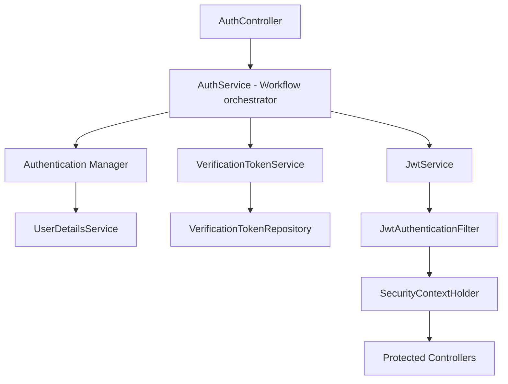

# Authentication Module

### Overview

The authentication module is responsible for user identity, account verification, and application security. It provides a complete authentication workflow including user registration, email verification, login, and JWT-based stateless authentication.

The module is designed with a production-oriented approach, emphasizing security, maintainability, and clear separation of responsibilities. Authentication-related workflows are coordinated through dedicated services, while responsibilities such as token management, email delivery, and object mapping are delegated to specialized components.

The module follows Spring Security best practices and integrates with JWT for stateless authentication.

---

### Module Responsibilities

The authentication module is responsible for all functionality related to user identity and application security.

Its primary responsibilities include:

* Registering new users.
* Authenticating users using Spring Security.
* Issuing JWT access tokens.
* Validating JWTs for authenticated requests.
* Managing email verification.
* Preventing unverified accounts from authenticating.
* Coordinating authentication workflows through dedicated services.
* Publishing authentication-related domain events.
* Managing verification token lifecycle.
* Mapping authentication requests and responses using DTOs.
* Providing authentication-related exception handling.

The module intentionally avoids business domain concerns (events, registrations, payments).

### Component Flow

