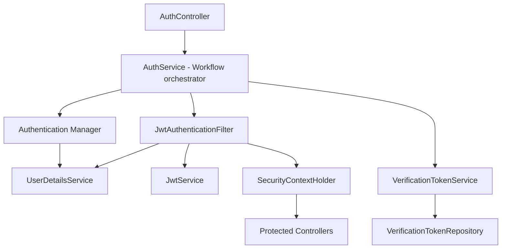
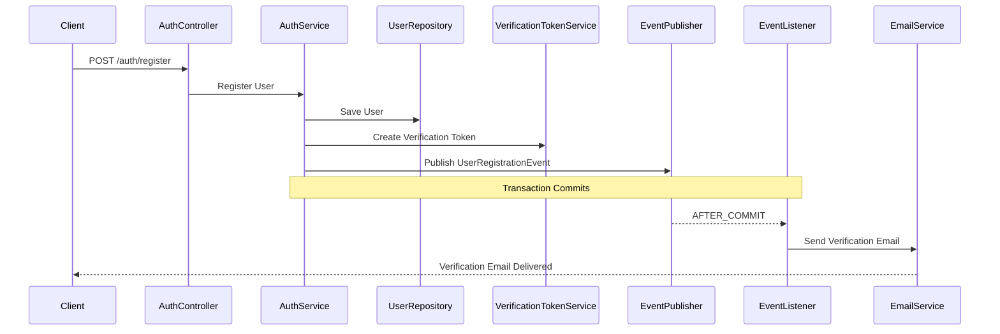
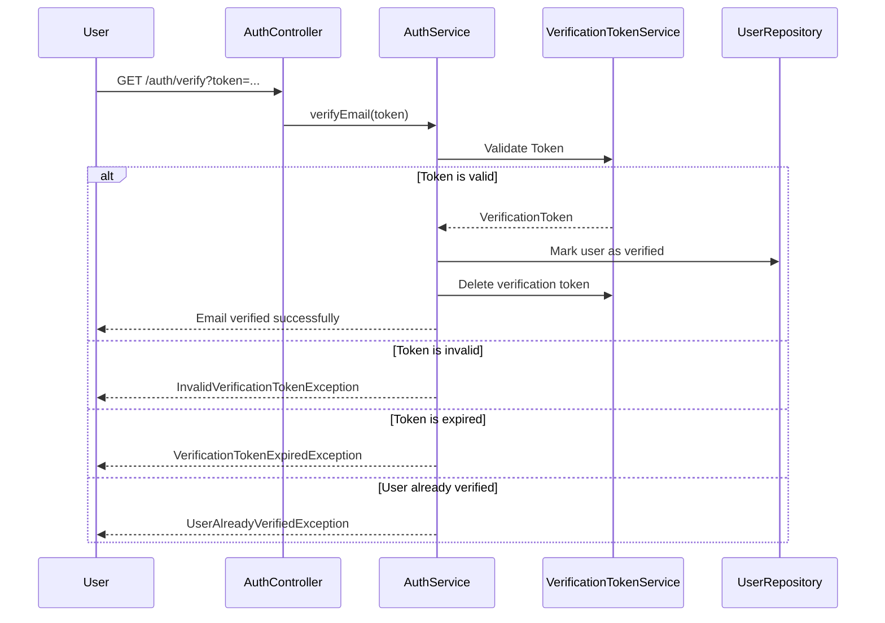
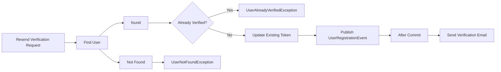
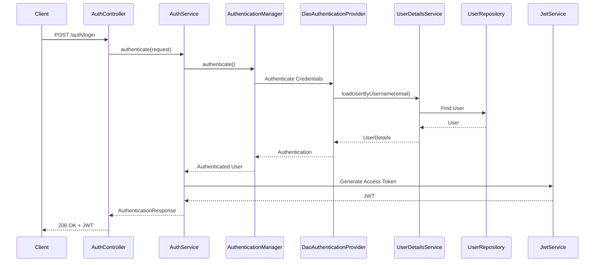
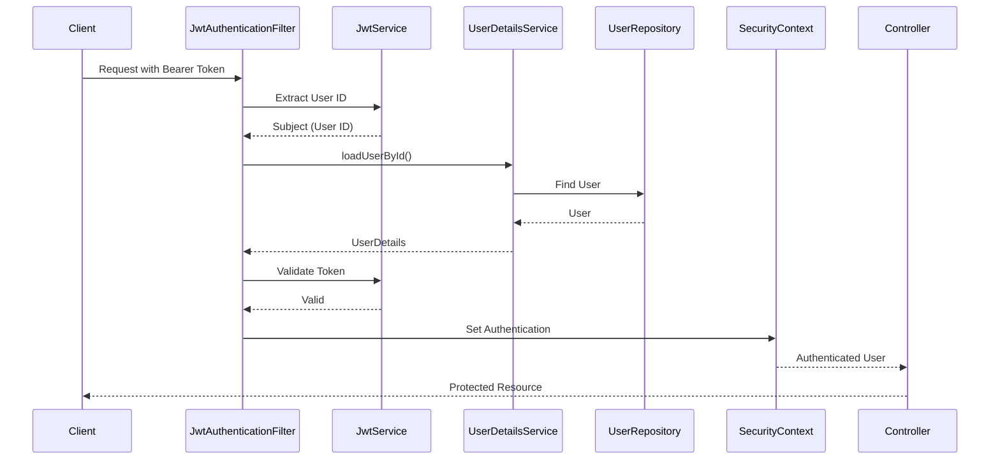

# Authentication Module

### Overview

The authentication module is responsible for user identity, account verification, and application security. It provides a complete authentication workflow including user registration, email verification, login, and JWT-based stateless authentication.

The module is designed with a production-oriented approach, emphasizing security, maintainability, and clear separation of responsibilities. Authentication-related workflows are coordinated through dedicated services, while responsibilities such as token management, email delivery, and object mapping are delegated to specialized components.

The module follows Spring Security best practices and integrates with JWT for stateless authentication.

---

### Module Responsibilities

The authentication module is responsible for all functionality related to user identity and application security.

Its primary responsibilities include:

* Registering new users.
* Authenticating users using Spring Security.
* Issuing JWT access tokens.
* Validating JWTs for authenticated requests.
* Managing email verification.
* Preventing unverified accounts from authenticating.
* Coordinating authentication workflows through dedicated services.
* Publishing authentication-related domain events.
* Managing verification token lifecycle.
* Mapping authentication requests and responses using DTOs.
* Providing authentication-related exception handling.

The module intentionally avoids business domain concerns (events, registrations, payments).

### Component Flow

--- 

### Registration Flow

 * Registration is Transactional
 * Email sending is not inside the registration transaction
 * The email is only sent after successful transaction
 * Email delivery is asynchronous
 * Responsibilites are cleary separated

 I adopted Event Publisher, Transactional Event Listener for solving issuesof @Transaction + @Async.

---

### Email-Verification Flow

--- 

### Verification Token LifeCycle

* Verification Token is only created when user is successfully registered.
* Each user has atmost one active verification token.
* Resending Verification token would update existing token rather than creating a new token for user.
* After successful verification, verification token is deleted permanently.
* Unverified users are prevented for authenticating.
* Token has expiry. If expired token is requested for verification it would throw VerificationTokenExpiredException.

### Resend-Verification Flow 

---

### Login flow

Workflow:
 
* The Client submits valid user credentials.
* The request is delegated to Spring Security's Authentication Manager.
* DaoAuthenticationProvider validates the credentials using the configured UserDetailsService and PasswordEncoder.
* After successful authentication, AuthService generates the JWT access token.
* The access token is returned to client.
* The client includes the token in authorization header for all protected requests or endpoints.

--- 

### JWT Structure

**Claim and Purpose**
1. sub: UserId
2. role: User's role for authorization
3. iat: Token issued time.
4. exp: Token Expiry date.

The JWT contains only the claims required by the application. Additional user information is retrieved from the database when needed to ensure account status remains authoritative.

### Security Notes

* Passwords are never stored or transmitted in plain text.
* Password verification is delegated to Spring Security.
* JWTs are signed using a server-side secret key.
* Tokens are time-limited to reduce risk if compromised.
* Authentication is stateless; no HTTP session is created.

---

### Role Claim

The JWT includes the authenticated user's role as a custom claim.

The role claim is intended to support authorization decisions throughout the application while keeping the token lightweight.

Current characteristics:

* The role is added to the JWT when the access token is generated.
* The claim represents the user's role at the time of authentication.
* The token itself is digitally signed, preventing clients from modifying the role without invalidating the signature.

Although the role is present in the JWT, the application currently loads the authenticated user from the database for each authenticated request. This ensures that account status checks (such as disabled or locked accounts) always reflect the latest state of the user.

This design provides a balance between performance and security while keeping the system flexible for future enhancements.

Future versions of EventHub will leverage the role claim for Role-Based Access Control (RBAC), enabling authorization of protected resources based on user roles.

---

### JWT Authentication Flow

### JWT Request Processing

* The client includes the JWT in the Authorization header.
* **JwtAuthenticationFilter** intercepts the request.
* The filter extracts the JWT and retrieves the user ID (sub).
* The user is loaded from the database using the extracted ID.
* The token is validated against the authenticated user.
* If valid, an authenticated **Authentication** object is created.
* The **SecurityContextHolder** is populated.
* The request proceeds to the target controller. 

**JwtAuthenticationFilter** extends **OncePerRequestFilter** to ensure JWT authentication is executed only once for each HTTP request. This avoids duplicate authentication processing during internal request dispatches and aligns with Spring Security's recommended approach for implementing custom authentication filters.

---

### Package Structure 

**auth**
- controller - For handling and validating requests and then delegating it to service layer. Recieves the response from service and delegate that to client.
- dto - Use for transfering data from client to domain entities, and for sending responses to client.
- entity - Domain entities for auth module
- event - To store event classes. Event is adata carrier object representing a state change.
- exception - Custom exception for Authentication module.
- listener - To store the listener classes. listener the recipient component that intercepts and processes the event.
- mapper - Classes to map DTOs and entities using Mapstruct.
- repository - To provide methods for performing Database operation
- security - For handling the security of application
- service - For processing the data and performing the business logic of the application.

### Public API

| Endpoint                         | Description                           |
| -------------------------------- | ------------------------------------- |
| `POST /auth/register`            | Register a new user                   |
| `POST /auth/login`               | Authenticate user and return JWT      |
| `GET /auth/me`                   | Retrieve authenticated user's profile |
| `GET /auth/verify`               | Verify email address                  |
| `POST /auth/resend-verification` | Resend verification email             |

### Future Enhancements

The following improvements are planned but intentionally postponed:

- Refresh Token support
- Secure Logout / Token Revocation
- OAuth2 / Social Login
- Key Rotation
- Multi-device Session Management
- Rate Limiting for Authentication Endpoints
- Audit Logging

The authentication module provides a complete, stateless authentication solution built on Spring Security and JWT. It follows a production-oriented architecture with clear separation of responsibilities, transactional event-driven workflows, and extensible security design. The module serves as the security foundation for all future EventHub features.